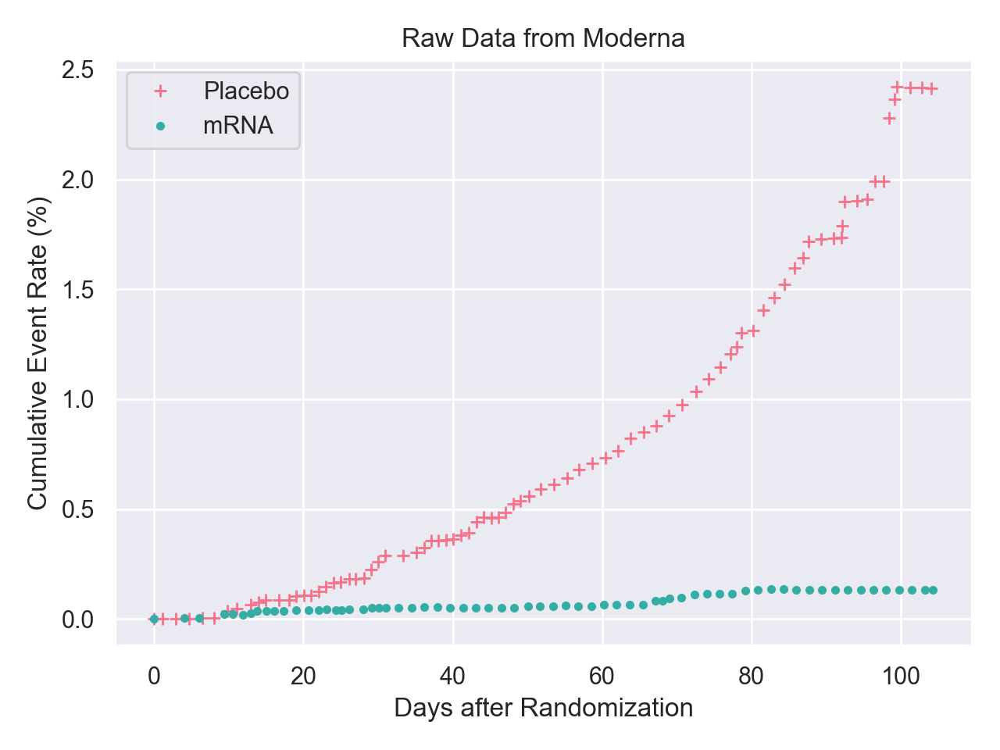
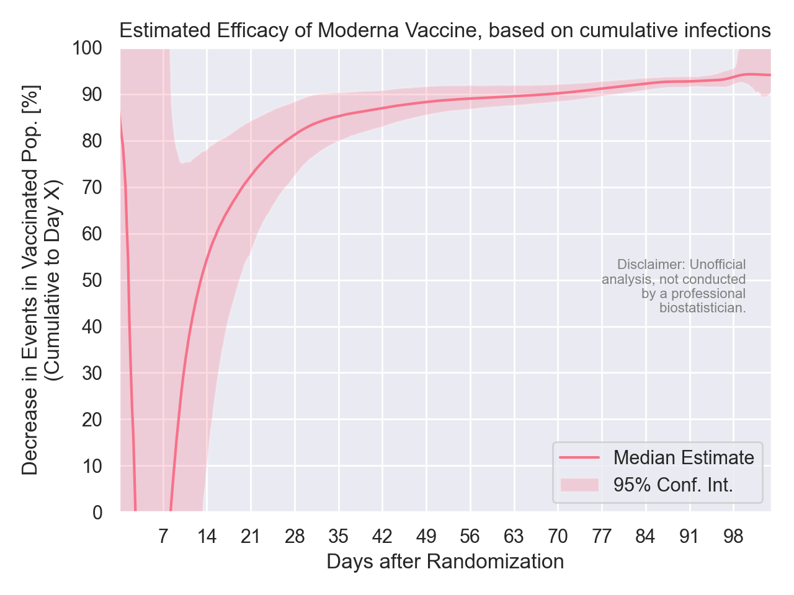
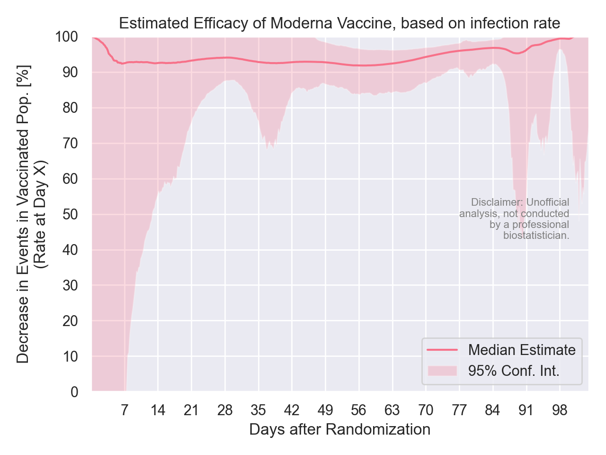

# ModernaVaccineEffectiveness

Peter Sharpe

A bit of analysis I did out of curiosity after receiving the Moderna COVID vaccine today.

Disclaimer: I'm an engineer, not a biostatistician - this data analysis and the figures that result from it are not official and may have errors or inaccuracies. Consult your region's public health department for actionable information.

Based on underlying data [here](https://www.fda.gov/media/144453/download), from the FDA:

We can do two analyses. The first estimates effectiveness by looking at the cumulative number of people that fell ill on or before Day X.

The second analysis estimates effectiveness by looking at the rate that people were falling ill on Day X. (Because this is a derivative of noisy data, there is more uncertainty.)

See analysis in [analysis.ipynb](analysis.ipynb).
